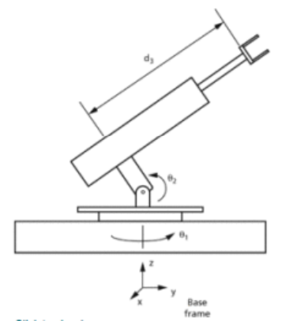
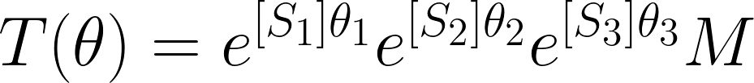
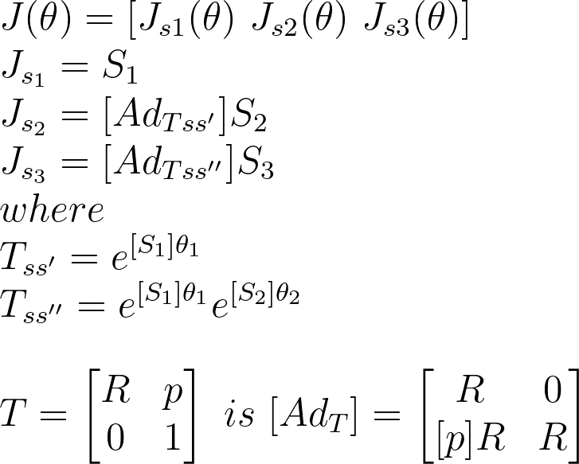
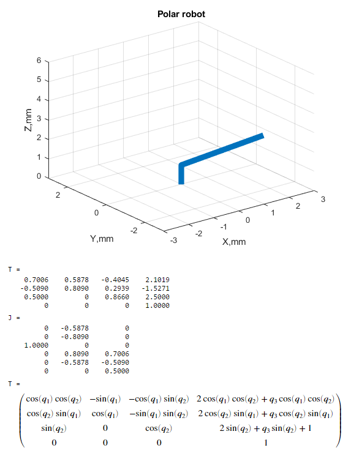
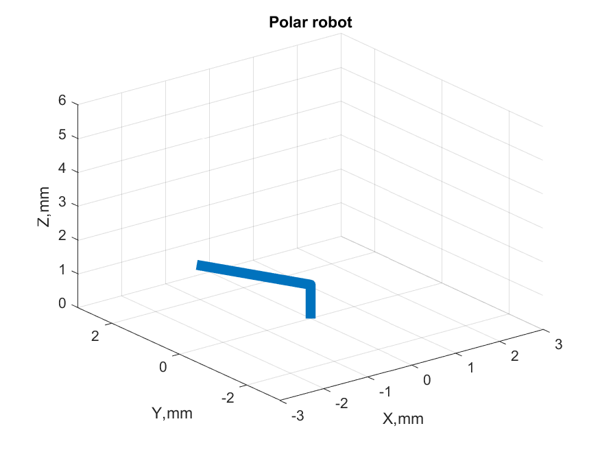

# Forward kinematics of planar robot

## Robot model

It is a robot with 3 active joints (RRP).

We assumed following robot dimensions:
```
link 1 = 1 m;
link 2 (for q_3 = 0) = 2 m;
```



## Forward kinematics




T = FK(M,S,q), where M – zero position matrix, S – matrix of skew vectors, q – joints positions

## Forward kinematics




J = Jac(S,q), where Mzero position matrix, S - matrix of skew vectors, q – joints positions

## Robot visualization

Example for q = [-pi/5 pi/6 1]'





